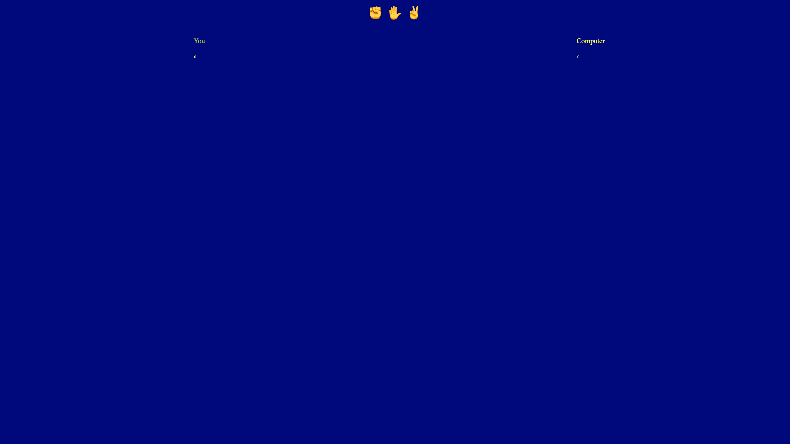

# 3, 2, 1... JANKEN!!!

This is a simple HTML, JavaScript, CSS version of the classic game Rock, Paper, Scissors.  Utilized emojis because they have the most consistent picture sizes when I was googling around for placeholders. 

### An example of what it looks like is below

